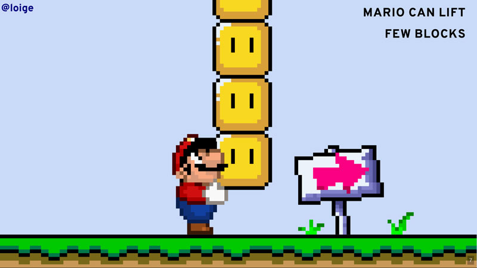

# 01 - Buffer vs Stream

- [01.1 buffers intro](#011-buffers-intro)
- [01.2 Streaming intro](#012-streaming-intro)

## 01.1 buffers intro

Let's create a Node.js script to copy a file from one place to another:

```javascript
// buffer-copy.js

const {
  readFileSync,
  writeFileSync
} = require('fs')

const [,, src, dest] = process.argv

// read entire file content
const content = readFileSync(src)

// write that content somewhere else
writeFileSync(dest, content)
```

You can use this script as follows:

```bash
node buffer-copy <source-file> <dest-file>
```

> **🎭 PLAY**  
> Play with this a bit and try to copy some files in your machine.

But did you ever wonder what happens when you try to copy a big file (more than 1.5Gb)?

> **🎭 PLAY**  
> Generate a big file (3gb) called file.txt in your machine with:
>
> ```bash
> dd if=/dev/zero of=file.txt count=3145728 bs=3145728
> ```
>
> Now try to copy it with our previous script.

What happens is that you should see your script dramatically failing with the following error:

```plain
ERR_FS_FILE_TOO_LARGE: File size is greater than possible Buffer
```

Why is this happening?

Essentially because when we use `fs.readFileSync` we load all the binary content from the file in memory into a `Buffer` object. Buffers are limited in size as they live in memory.

Let's try to explain this better with an analogy...

Imagine instead of copying bytes of data you have to help Mario moving blocks from one place to another:


Mario can lift some blocks:



But, if you have to move many blocks, he can't definitely move all of them in one go:


So what can we do? What if we want to find an approach that works independently from the number of blocks we have to move?


Mario can move the blocks one by one, he can stream them!


## 01.2 Streaming intro

How can we convert our implementation into a streaming one?

It's very easy actually:

```javascript
// stream-copy.js

const {
  createReadStream,
  createWriteStream
} = require('fs')

const [,, src, dest] = process.argv

// create source stream
const srcStream = createReadStream(src)

// create destination stream
const destStream = createWriteStream(dest)

// when there's data on the source stream,
// write it to the dest stream
// WARNING, this solution is not perfect as we will see later
srcStream.on('data', (data) => destStream.write(data))
```

Essentially we are replacing `readFileSync` with `createReadStream` and `writeFileSync` with `createWriteStream`.

`createReadStream` and `createWriteStream` are then used to create two stream instances `srcStream` and `destStream`. These objects are respectively instances of a `ReadableStream` (input) and a `WritableStream` (output) and we will talk more about these in the next chapters.

...


| [⬅️ 00 - Intro](/README.md) | [🏠](/README.md)| [02 - Readable Streams ➡️](/02-readable-streams)|
|:--------------|:------:|------------------------------------------------:|
