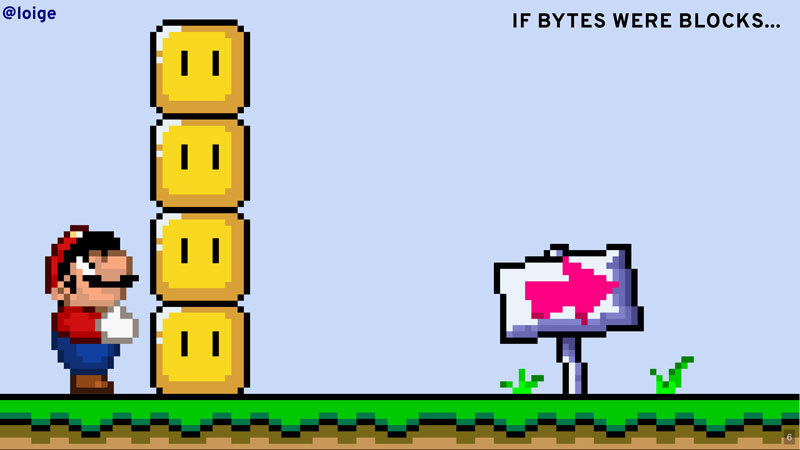
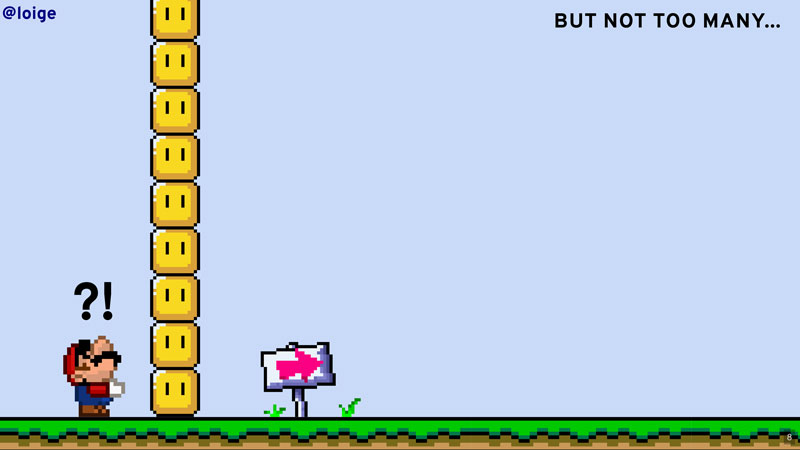
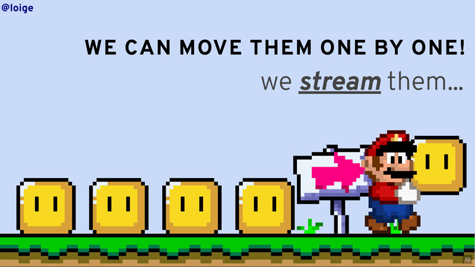
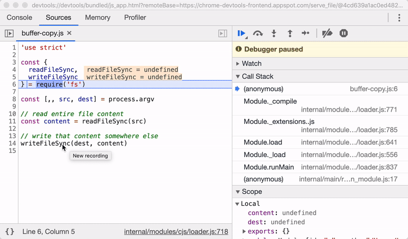

# 01 - Buffer vs Stream

- [01.1 buffers intro](#011-buffers-intro)
- [01.2 Streaming intro](#012-streaming-intro)
- [01.3 Memory comparison](#013-memory-comparison)
- [01.4 Our friend `Buffer`](#014-our-friend-buffer)
- [01.5 Our new friend stream](#015-our-new-friend-stream)
- [01.6 Summary](#016-summary)


## 01.1 buffers intro

Let's create a Node.js script to copy a file from one place to another:

```javascript
// buffer-copy.js

const {
  readFileSync,
  writeFileSync
} = require('fs')

// `src` is the first argument from cli, `dest` the second
const [,, src, dest] = process.argv

// read entire file content
const content = readFileSync(src)

// write that content somewhere else
writeFileSync(dest, content)
```

You can use this script as follows:

```bash
node buffer-copy <source-file> <dest-file>
```

> **🎭 PLAY**  
> Play with this a bit and try to copy some files in your machine.

But did you ever wonder what happens when you try to copy a big file (more than 1.5Gb)?

> **🎭 PLAY**  
> Generate a big file (3gb) called `assets/3Gb.bin` in your machine with:
>
> ```bash
> head -c $((3*1024*1024*1024)) /dev/urandom > assets/3Gb.bin
> ```
>
> Now try to copy it with our previous script.

What happens is that you should see your script dramatically failing with the following error:

```plain
ERR_FS_FILE_TOO_LARGE: File size is greater than possible Buffer
```

Why is this happening?

Essentially because when we use `fs.readFileSync` we load all the binary content from the file in memory using a `Buffer` object. Buffers are, by design, limited in size as they live in memory.

Let's try to explain this better with an analogy...

Imagine that, instead of copying bytes of data, you are using Mario to move blocks from one place to another:



Mario can lift some blocks:


But, if he has to move many blocks, he can't definitely move all of them in one go:



So what can he do? What if he wants to find an approach that works independently from the number of blocks he has to move?



Mario can move the blocks one by one, he can stream them!


## 01.2 Streaming intro

How can we convert our copy file implementation into a streaming one?

It's very easy actually:

```javascript
// stream-copy.js

const {
  createReadStream,
  createWriteStream
} = require('fs')

const [,, src, dest] = process.argv

// create source stream
const srcStream = createReadStream(src)

// create destination stream
const destStream = createWriteStream(dest)

// when there's data on the source stream,
// write it to the dest stream
// WARNING, this solution is not perfect as we will see later
srcStream.on('data', (chunk) => destStream.write(chunk))
```

Essentially we are replacing `readFileSync` with `createReadStream` and `writeFileSync` with `createWriteStream`.

`createReadStream` and `createWriteStream` are then used to create two stream instances `srcStream` and `destStream`. These objects are respectively instances of a `ReadableStream` (input) and a `WritableStream` (output) and we will talk more in detail about these in the next chapters. For now, the only important detail to understand is that streams are not *eager*, they don't read all the data in one go. The data is read in *chunks*, small portions of data. You can immediately use a chunk as soon as it is available through the `data` event. In our case, when a new chunk of data is available in the source stream we immediately write it to the destination stream. This way we never have to keep all the file content in memory.

This implementation here is not perfect, there are some rough edge cases that we will discover later while discussing Writable streams in more detail, but for now this is good enough to understand the basic principles of stream processing in Node.js!

> **🎭 PLAY**  
> Try to copy our `big-file.txt` using this new streaming implementation!


## 01.3 Memory comparison

Let's now see how the two implementations (buffer and streaming) compare in terms of memory usage. We can do that by using Google Chrome developer tools.

First of all let's create a 600Mb file called `assets/60mb.txt`:

```bash
head -c $((600*1024*1024)) /dev/urandom > assets/600mb.bin
```

This might take few minutes... be patient, please.

Now let's run the buffer copy in debug mode:

```bash
node --inspect-brk=0.0.0.0:9229 01-buffer-vs-stream/buffer-copy.js assets/600mb.bin assets/600mb.bin_copy
```

This script will pause straight away thanks to the `--inspect-brk` flag.

Open Google Chrome and visit [chrome://inspect/](chrome://inspect/).

Click on the **inspect** link at the bottom of the page.

This should open a Chrome developer tool window.

> **Note:**, if you are using Docker, this might not work straight away and you might not see the link. If you have any issue, don't worry, just keep reading and move along. There are ways to get this working in docker, but it gets a bit too complicated. So, if you are short of time, it's best to skip trying this, as this is not the core of the workshop.

You can see that our script is currently paused. Add a breakpoint in the last line where we write the content to the destination (so that the script will stop before executing that last line). Now execute the script and see it getting paused in the last line by the breakpoint. At this point, switch to the **Memory** tab and select the option **Heap Snapshoot** and then click the button **Take Snapshot**. This operation allows you to see all the memory currently allocated by the Node.js process.



If all went as expected you should see that the total amount of memory is around 600Mb. Not surprising right? If we load all the content of the file in a buffer, the content of the file is essentially loaded all in memory!

> **🎭 PLAY**  
> Try to do the same with our streaming alternative to find out how much memory is used!
>
> Advice: since the streaming approach is asynchronous is hard to put a meaningful breakpoint. In order to make things easy, you can add the following line at the end of the code:
>
> ```javascript
> srcStream.on('end', () => destStream.end())
> destStream.on('finish', () => {
>   console.log('done')
> })
> ```
>
> Now you can add the breakpoint in the `console.log` line

How much memory did you get?

> **🎭 PLAY**  
> Why not to try the same exercise with the 3Gb file?

At this point you should have clear in mind why Streams are so convenient 🙂

> **Note:**, if you are using Docker, and couldn't manage to get this working, the gist of it is that the buffered approach will consume at least as much memory as the amount of data you are copying, while the streaming approach keeps a constant memory footprint (about 4kb) regardless on how much data you are copying around.


## 01.4 Our friend `Buffer`

The `Buffer` object is such a fundamental concept in Node.js and it's heavily used also with streams. So it's definitely worth spending some extra minutes to get more familiar with it.

In its essence a Buffer is a data structure that allows us to manage raw binary data.

The most common way to create a buffer from scratch is by using the `.from` method:

```javascript
const a = Buffer.from('Hello') // data from a utf8 string
const b = Buffer.from('48656c6c6f', 'hex') // data from an hex string
const c = Buffer.from('SGVsbG8=', 'base64') // data from a base64 encoded binary sequence
const d = Buffer.from([0x48, 0x65, 0x6c, 0x6c, 0x6f]) // data from an array of integers (bytes)
```

If you console log one of these instances you will get something like this:

```plain
<Buffer 48 65 6c 6c 6f>
```

Or if you do something like:

```javascript
const b = Buffer.from('48656c6c6f', 'hex')
console.log(b.toJSON())
```

You will see something like this:

```json
{
  "type": "Buffer",
  "data": [ 72, 101, 108, 108, 111 ]
}
```

Which is the proof that, internally, a buffer is represented as an array of bytes.

Another common way to create a buffer instance is `Buffer.alloc(n)` that allows you to create an empty buffer (all zeros) of `n` bytes.

If you want to inspect the content of a Buffer instance you can do that with the `.toString(encoding)` method, which accepts different types of encoding such as `'base64'`, `'hex'` or `'utf8'` (default value).

```javascript
const a = Buffer.from('Hello')
a.toString() // 'Hello'
a.toString('hex') // '48656c6c6f'
a.toString('base64') // 'SGVsbG8='
```

To get the size of a buffer (in bytes) you can use the property `.length`:

```javascript
const a = Buffer.from('Hello')
const b = Buffer.from('Hello👻')
const c = Buffer.from('👻')
a.length // 5
b.length // 9
c.length // 4 (yes, an emoji is a multi-byte character!)
```

Other useful operations on buffers are `.slice` and `Buffer.concat`. `.slice allows you to get an arbitrary sub section of a buffer`:

```javascript
const a = Buffer.from('Hello dear friends')
a.slice(6,10).toString() // 'dear'
```

`Buffer.concat([...buffers])` allows you to concatenate the content of 2 or more buffers:

```javascript
const a1 = Buffer.from('Hello')
const a2 = Buffer.from(', ')
const a3 = Buffer.from('World')
const all = Buffer.concat([a1, a2, a3])
all.toString() // 'Hello, World'
```

> **🎭 PLAY**  
> Try all the commands above in a Node.js shell


## 01.5 Our new friend stream

Streams are the topic of this workshop, so we will definitely go into great depth!

For now there are only 2 important things to keep in mind about streams instances:

- Every stream is an event emitter (we already saw the `data` and the `end` events)
- In the `streamInstance.on('data', (chunk) => {})` event, `chunk` is a buffer instance that contains the current portion of the data being read from the source

> **🏹 Exercise** ([count-bytes.js](/01-buffer-vs-stream/exercises/count-bytes.js))
>
> Write a function that receives a stream and counts the number of bytes in the stream.
>
> A skeleton of the file is available at `01-buffer-vs-stream/exercises/count-bytes.js`.
>
> You can edit the file and run an interactive test session to validate your implementation with:
>
> ```bash
> npm test -- 01-buffer-vs-stream/exercises/count-bytes.test.js
> ```
>
> If you really struggle with this, you can have a look at [`count-bytes.solution.js`](/01-buffer-vs-stream/exercises/count-bytes.solution.js) for a possible solution.


## 01.6 Summary

At this point you should be more familiar with the concepts of buffer and stream and you should start to understand how streams are a convenient paradigm in comparison with loading big buffers straight into memory.

If I had to summarise why streams are better than buffers, here are few points:

- Streams can keep a **low memory footprint** even with large amounts of data
- Streams allows you to **process data as soon as it is available**


That's all for now, congratulations on finishing the first chapter! 🎉

Take a little break and get ready to move to the [Next section](/02-readable-streams/README.md).

---

| [⬅️ 00 - Intro](/README.md) | [🏠](/README.md)| [02 - Readable Streams ➡️](/02-readable-streams/README.md)|
|:--------------|:------:|------------------------------------------------:|
