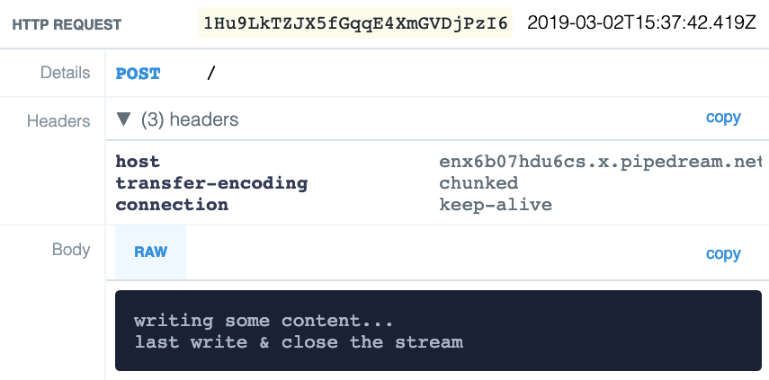

# 03 - Writable Streams

- [03.1 What is a Writable stream](#031-what-is-a-writable-stream)
- [03.2 Using Writable streams](#032-using-writable-streams)


## 03.1 What is a Writable stream

A Writable stream is an abstraction that allows to write data over a destination. In a way you can see Writable streams as an abstraction for output.

Some notable instances of Writable streams:

- Writing to a file with `fs.createWriteStream()`
- Command line standard output and standard error (`process.stdout`, `process.stderr`)
- An HTTP request (when sent by a client)
- An HTTP response (when sent by a server)
- AWS S3 `PutObject` (`body` parameter)


## 03.2 Using Writable streams

Let's try to use a Writable stream to send an HTTP request to a server. We are not going to use any third party HTTP library, we will rely on the native Node.js `http` module.

```javascript
// writable-http-request.js

const http = require('http')

const req = http.request(
  {
    hostname: 'enx6b07hdu6cs.x.pipedream.net',
    method: 'POST'
  },
  (resp) => {
    console.log(`Server responded with "${resp.statusCode}"`)
  }
)

req.on('finish', () => console.log('request sent'))
req.on('close', () => console.log('Connection closed'))
req.on('error', err => console.error(`Request failed: ${err}`))

req.write('writing some content...\n')
req.end('last write & close the stream')
```

When we use `http.request()` we get back a request object. This object is a Writable stream.

We can attach event listeners like `finish` (when the request is fully sent), `close` (when the connection with the server is closed), `error` (to catch any error).

In order to write content to the server through the request object we can invoke `write(data)` and `end(data)`.

These two methods from writable streams allows to write data over the destination. The data can be a `string` or a `Buffer`.

When using `end(data)`, the connection with the destination will be closed after the write is completed, so it is generally used to write the last chunk of data. You can also call `end()` without any `data` argument if you want to just close the stream without writing more data.

If you run the previous snippet of code, you should see the following output on the client:

```plain
Request sent
Server responded with "200"
Connection closed
```

This is instead what the server will receive:



You can see that the payload of the received request contains:

```plain
writing some content...
last write & close the stream
```

> **🎭 PLAY**  
> Get a new server sandbox URL on [requestbin.com/](https://requestbin.com/), update the code with the new endpoint and try to run some requests. Inspect the output on the client side and on the server side.


---

| [⬅️ 02 - Readable streams](/02-readable-streams/README.md) | [🏠](/README.md)| [04 - Transform Streams ➡️](/04-transform-streams/README.md)|
|:--------------|:------:|------------------------------------------------:|
